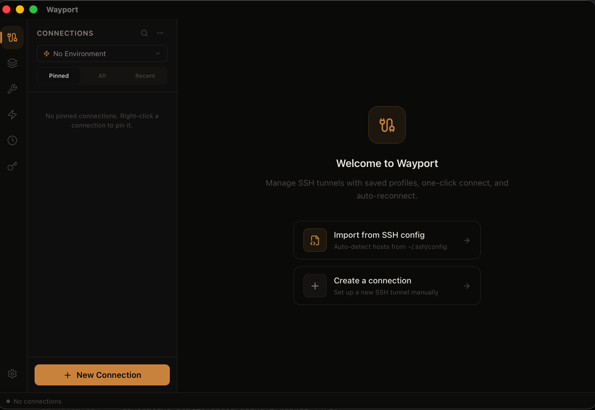

<p align="center">
  
</p>

<h1 align="center">Wayport</h1>
<p align="center">SSH tunnels, managed. Save connections, connect in one click, share with your team.</p>

<p align="center">
  <a href="https://wayport.dev">Website</a> &middot;
  <a href="https://github.com/shyax/wayport/releases">Download</a> &middot;
  <a href="https://github.com/shyax/wayport/blob/main/CONTRIBUTING.md">Contributing</a> &middot;
  <a href="https://x.com/0shyax">X</a>
</p>

<p align="center">
  <a href="https://github.com/shyax/wayport/actions/workflows/ci.yml"></a>
  <a href="https://github.com/shyax/wayport/releases"></a>
  <a href="LICENSE"></a>
</p>

---

A lightweight, cross-platform desktop app and CLI for managing SSH port-forwarding tunnels.
Save connection profiles, connect with one click, and keep your tunnels alive automatically.

## Features

- **Save & recall connections** — Store SSH tunnel profiles and reconnect with a single click
- **Multi-tunnel support** — Run multiple SSH tunnels simultaneously with live status indicators
- **Auto-reconnect** — Automatically re-establish dropped tunnels with exponential backoff
- **Tunnel groups** — Bundle related tunnels and start/stop them together
- **Kubernetes port-forward** — `kubectl port-forward` profiles alongside SSH tunnels
- **Import / export** — Share connection configs via JSON, YAML, or TOML
- **SSH config import** — Import hosts directly from `~/.ssh/config`
- **Port utilities** — Scan, kill, and monitor ports; detect conflicts before connecting
- **Environment variables** — Substitute `${VAR}` in connection fields for staging/prod switching
- **Command palette** — `Cmd+K` to quickly find and connect to any tunnel
- **SSH key management** — Generate and manage SSH keys from the app
- **Connection history** — Track when tunnels were connected, disconnected, and errors
- **Cloud sync** (optional) — Sign in to sync profiles across devices
- **CLI** — Manage tunnels from the terminal with `wayport` commands
- **Cross-platform** — macOS, Windows, and Linux via Tauri v2
- **Tiny binary** — ~5-10 MB download (vs. Electron's 150 MB)

## Install

### Desktop app

Get the latest release from the [GitHub Releases](https://github.com/shyax/wayport/releases) page.

| Platform | File |
|----------|------|
| macOS (Apple Silicon) | `Wayport_*_aarch64.dmg` |
| macOS (Intel) | `Wayport_*_x64.dmg` |
| Windows | `Wayport_*_x64-setup.exe` |
| Linux | `wayport_*_amd64.AppImage` |

### CLI

**Homebrew** (macOS / Linux):

```bash
brew install shyax/tap/wayport
```

**Manual download** — grab the binary from [GitHub Releases](https://github.com/shyax/wayport/releases):

| Platform | File |
|----------|------|
| macOS (Apple Silicon) | `wayport-darwin-arm64.tar.gz` |
| macOS (Intel) | `wayport-darwin-x64.tar.gz` |
| Linux | `wayport-linux-amd64.tar.gz` |
| Windows | `wayport-windows-x64.zip` |

**From source:**

```bash
cargo install --path cli
```

## Tech Stack

| Layer | Technology |
|-------|-----------|
| Desktop frontend | React 19, TypeScript, Tailwind CSS v4, Zustand, Vite |
| Desktop backend | Rust, Tauri v2, SQLite (rusqlite) |
| CLI | Rust, Clap v4 |
| Shared core | `wayport-core` crate — types, database, tunnel logic |
| Landing page | Next.js 16, Three.js, Framer Motion |
| Cloud sync | AWS Cognito, API Gateway, Lambda, DynamoDB (optional, self-hostable) |
| Infrastructure | Terraform |

## Monorepo Layout

```
wayport/
  ├── desktop/                # Tauri v2 desktop app
  │   ├── src/                # React frontend
  │   │   ├── components/     # UI components
  │   │   ├── stores/         # Zustand state stores
  │   │   └── lib/            # Tauri IPC bindings + types
  │   └── src-tauri/          # Rust backend
  │       └── src/
  │           ├── commands.rs      # IPC handlers (~25 commands)
  │           ├── tunnel_manager.rs
  │           ├── store.rs
  │           ├── database.rs
  │           └── port_utils.rs
  ├── cli/                    # wayport CLI (Rust + Clap)
  ├── crates/
  │   └── wayport-core/      # Shared Rust types and logic
  ├── landing/                # Marketing site (Next.js)
  ├── infra/
  │   ├── terraform/          # AWS infrastructure
  │   └── lambda/             # Sync handler functions
  └── docs/                   # Architecture docs
```

## Development

### Prerequisites

- Node.js 20+
- Rust 1.77+ (via [rustup.rs](https://rustup.rs))
- [Tauri v2 prerequisites](https://v2.tauri.app/start/prerequisites/)
- OpenSSH (standard on macOS/Linux; ships with Windows 10+)

### Desktop app

```bash
cd desktop
npm install
npm run tauri dev      # dev server with hot reload
npm run tauri build    # production build + bundle
```

### CLI

```bash
cargo build -p wayport-cli --release
./target/release/wayport --help
```

### Landing page

```bash
cd landing
npm install
npm run dev
```

### All Rust checks

```bash
cargo check --workspace
cargo clippy --workspace -- -D warnings
cargo fmt --all -- --check
cargo test --workspace
```

## Cloud Sync (optional)

Wayport works fully offline by default. All connections are stored locally in SQLite at `~/.config/Wayport/`.

Optionally, you can enable cloud sync to share profiles across devices:

1. Deploy the sync infrastructure: `cd infra/terraform && terraform apply`
2. Set the env vars output by Terraform when building the desktop app:
   ```
   VITE_COGNITO_USER_POOL_ID=...
   VITE_COGNITO_CLIENT_ID=...
   VITE_COGNITO_DOMAIN=...
   VITE_SYNC_API_URL=...
   ```
3. The app shows a "Sign in with SSO" screen on launch

Without these env vars, the auth system is completely invisible and the app behaves as a local-only tool.

**Self-hosting:** The Terraform config in `infra/terraform/` deploys everything you need (Cognito user pool, API Gateway, Lambda handlers, DynamoDB table). See `infra/terraform/variables.tf` for configuration options.

## CLI Commands

| Command | Description |
|---------|------------|
| `wayport ls` | List saved profiles |
| `wayport connect <name>` | Start a tunnel |
| `wayport disconnect <name>` | Stop a tunnel |
| `wayport status` | Show active tunnels |
| `wayport scan <port>` | Check what's using a port |
| `wayport kill <port>` | Kill process on a port |
| `wayport logs <name>` | View tunnel logs |
| `wayport group start <name>` | Start a tunnel group |
| `wayport import-ssh` | Import from `~/.ssh/config` |
| `wayport import <file>` | Import JSON/YAML/TOML profiles |
| `wayport export` | Export profiles |
| `wayport history` | View connection history |

CLI and desktop app share the same SQLite database, so they always see the same data.

## IPC Commands

The frontend communicates with the Rust backend via Tauri IPC:

| Command | Purpose |
|---------|---------|
| `list_profiles` / `create_profile` / `update_profile` / `delete_profile` | Profile CRUD |
| `start_tunnel` / `stop_tunnel` / `stop_all_tunnels` | Tunnel lifecycle |
| `get_tunnel_states` / `get_tunnel_logs` / `get_tunnel_stats` | Tunnel monitoring |
| `list_groups` / `create_group` / `start_group` / `stop_group` | Tunnel groups |
| `list_environments` / `create_environment` / `update_environment` | Environment variables |
| `list_folders` / `create_folder` / `update_folder` / `delete_folder` | Folder organization |
| `list_ssh_keys` / `generate_ssh_key` / `get_public_key` | SSH key management |
| `import_ssh_config` / `export_profiles` / `import_profiles` | Import/export |
| `scan_port` / `scan_port_range` / `kill_port` / `check_port_available` | Port utilities |
| `test_connection` / `open_terminal` | Connection tools |
| `load_auth_tokens` / `save_auth_tokens` / `clear_auth_tokens` | Auth persistence |
| `get_history` / `record_connection_event` | Connection history |
| `get_preference` / `set_preference` | User preferences |
| `pin_profile` / `unpin_profile` / `get_recent_profiles` | Quick access |

**Events:** `tunnel-state-update` (emitted when tunnel status changes), `deep-link-received` (OAuth callback)

## SSH Process Options

Wayport spawns the system `ssh` binary, so it honors your `~/.ssh/config`, SSH agent, and all key formats:

```bash
ssh -i <key> -L <local>:<remote_host>:<remote_port> -N \
  -o ServerAliveInterval=15 \
  -o ServerAliveCountMax=3 \
  -o ExitOnForwardFailure=yes \
  -o StrictHostKeyChecking=accept-new \
  <user>@<bastion>
```

After spawn, Wayport TCP-probes `localhost:<local_port>` every 500ms (10s timeout)
to confirm the tunnel is working before marking it "Connected".

## Cutting a Release

1. Update `CHANGELOG.md`
2. Bump version in `desktop/src-tauri/tauri.conf.json`
3. Commit and tag: `git tag vX.Y.Z && git push origin vX.Y.Z`
4. GitHub Actions builds all platforms and creates a draft release

See [CONTRIBUTING.md](CONTRIBUTING.md) for the full release checklist.

## Contributing

Contributions are welcome! See [CONTRIBUTING.md](CONTRIBUTING.md) for guidelines.

## License

MIT. See [LICENSE](LICENSE) for details.
